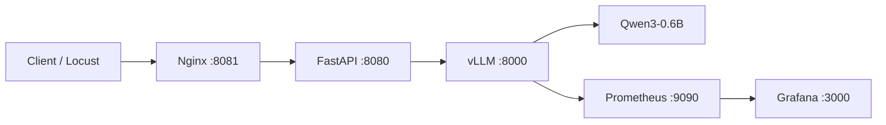

# LLM Serving Ops

一个面向学习与求职展示的单机 LLM Serving / LLMOps 项目，完整串联：

- Qwen3-0.6B
- vLLM OpenAI-Compatible Server
- FastAPI 业务网关
- Nginx 反向代理
- Prometheus 指标采集
- Grafana 可视化
- Locust 并发压测
- Docker Compose 一键编排

本项目已在 Windows + WSL2 + Docker Desktop + NVIDIA GeForce GTX 1650 4GB 环境中验证通过。

## Architecture



## Why this project

这个项目不是训练模型，而是学习“模型训练完成之后，如何把它稳定地跑成服务”。重点包括：

1. GPU 容器链路验证与显存约束。
2. vLLM 推理服务部署与 OpenAI-Compatible API。
3. FastAPI 业务层与推理层解耦。
4. Nginx Reverse Proxy、Upstream、Timeout。
5. Prometheus + Grafana 监控请求、KV Cache、吞吐和延迟。
6. Locust 进行可控并发压测。
7. Docker Compose 统一服务编排。

## Verified environment

| Item | Verified value |
|---|---|
| OS | Windows + WSL2 Ubuntu |
| GPU | NVIDIA GeForce GTX 1650, 4GB |
| NVIDIA Driver | 580.97 |
| CUDA reported by driver | 13.0 |
| Docker Desktop | 4.91.0 |
| Docker Engine | 29.8.0 |
| vLLM | 0.29.0 |
| Model | Qwen/Qwen3-0.6B |
| Grafana | 13.2.2 |

## Project structure

```text
llm-serving-ops/
├── compose.yaml
├── README.md
├── api/
│   ├── Dockerfile
│   ├── main.py
│   └── requirements.txt
├── nginx/
│   └── nginx.conf
├── prometheus/
│   └── prometheus.yml
├── grafana/
│   └── README.md
├── loadtest/
│   └── locustfile.py
├── scripts/
│   ├── start.bat
│   ├── stop.bat
│   ├── status.bat
│   ├── logs.bat
│   └── smoke_test.bat
├── docs/
│   ├── ARCHITECTURE.md
│   ├── TROUBLESHOOTING.md
│   ├── INTERVIEW.md
│   └── RESUME.md
└── results/
    └── README.md
```

## Quick start

### 1. Prerequisites

- Docker Desktop 使用 WSL2 backend。
- `docker run --gpus all ...` 已验证 GPU 可用。
- 模型缓存目录存在：`E:\LLM\Models`。
- 项目目录中的 `compose.yaml` 使用上述模型缓存路径。

### 2. First-time setup

Grafana 使用外部 volume 保存手工创建的 Dashboard：

```cmd
docker volume inspect grafana-storage >nul 2>&1 || docker volume create grafana-storage
```

### 3. Start

```cmd
scripts\start.bat
```

或直接：

```cmd
docker compose up -d --build
```

### 4. Status

```cmd
scripts\status.bat
```

### 5. Smoke test

等待 vLLM 模型加载完成后：

```cmd
scripts\smoke_test.bat
```

## Service ports

| Service | Host URL | Purpose |
|---|---|---|
| vLLM | `http://127.0.0.1:8000` | Model inference server |
| FastAPI | `http://127.0.0.1:8080` | Business/API gateway |
| Nginx | `http://127.0.0.1:8081` | External reverse proxy |
| Locust | `http://127.0.0.1:8089` | Load-test Web UI |
| Prometheus | `http://127.0.0.1:9090` | Metrics store/query |
| Grafana | `http://127.0.0.1:3000` | Dashboard |

在已验证环境中，Clash 可能干扰 `localhost`，因此本项目文档统一优先使用 `127.0.0.1`。

## Key API checks

```cmd
curl http://127.0.0.1:8000/v1/models
curl http://127.0.0.1:8080/health
curl http://127.0.0.1:8081/nginx-health
curl http://127.0.0.1:8081/model/info
```

Chat through the complete Nginx -> FastAPI -> vLLM chain:

```cmd
curl http://127.0.0.1:8081/chat -H "Content-Type: application/json" -d "{\"message\":\"请简单解释什么是vLLM。\",\"max_tokens\":128,\"temperature\":0.7}"
```

## Monitoring dashboard

建议保留 7 个核心 Panel：

| Panel | PromQL |
|---|---|
| Running Requests | `sum(vllm:num_requests_running)` |
| Waiting Requests | `sum(vllm:num_requests_waiting)` |
| KV Cache Usage | `100 * avg(vllm:kv_cache_usage_perc)` |
| Generation Throughput | `sum(rate(vllm:generation_tokens_total[1m]))` |
| P95 Queue Time | `histogram_quantile(0.95, sum by (le) (rate(vllm:request_queue_time_seconds_bucket[1m])))` |
| P95 TTFT | `histogram_quantile(0.95, sum by (le) (rate(vllm:time_to_first_token_seconds_bucket[1m])))` |
| P95 E2E Latency | `histogram_quantile(0.95, sum by (le) (rate(vllm:e2e_request_latency_seconds_bucket[1m])))` |

核心理解：

- Gauge：当前状态，可升可降。
- Counter：累计值，通常配合 `rate()` 看速度。
- Histogram：分桶统计，用 `histogram_quantile()` 看 P95/P99。

## Load testing

本机运行 Locust 时需要 Python 虚拟环境；Compose 本身不需要激活 `.venv`。

```cmd
.venv\Scripts\activate
locust -f loadtest\locustfile.py --host http://127.0.0.1:8000
```

Headless 示例：

```cmd
locust -f loadtest\locustfile.py --host http://127.0.0.1:8000 --headless -u 4 -r 4 -t 3m --csv results\c4
```

## Known-good vLLM settings for the verified 4GB GPU

```text
--dtype half
--max-model-len 1024
--max-num-seqs 1
--gpu-memory-utilization 0.75
--enforce-eager
```

Additionally, the verified WSL2 + vLLM 0.29.0 environment required:

```text
VLLM_USE_V2_MODEL_RUNNER=0
```

because the V2 runner failed with `RuntimeError: UVA is not available` in this environment. If vLLM is upgraded, retest this compatibility workaround rather than assuming it is still required.

## Common operations

```cmd
docker compose ps
docker compose logs -f vllm
docker compose logs -f api
docker compose restart api
docker compose stop
docker compose down
docker compose up -d
```

## Documentation

- `docs/ARCHITECTURE.md`: 架构演进与数据流。
- `docs/TROUBLESHOOTING.md`: 故障排查手册。
- `docs/INTERVIEW.md`: 面试高频问题与回答框架。
- `docs/RESUME.md`: 简历项目描述与自我介绍。
- `LLM-Serving-Ops-学习手册.docx`: 从零到一完整学习手册。

## Scope

本项目的目标是掌握一条完整的 LLM Serving / LLMOps 技术链，不追求学术式参数消融或极致推理性能。对于求职展示，能够解释架构、监控、压测、容器网络和真实故障定位，比堆更多中间件更重要。
