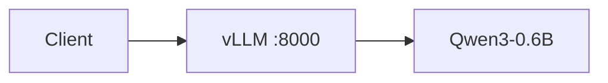
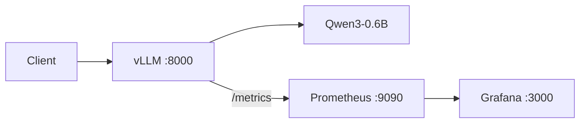
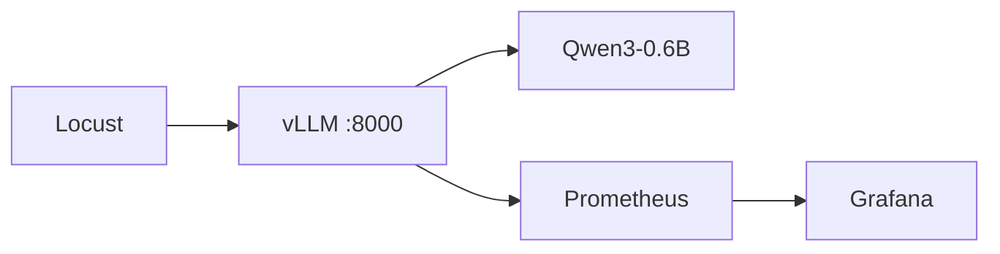
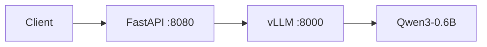
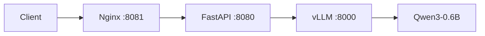
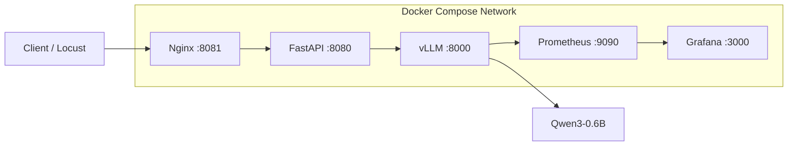

# Architecture Evolution

## Stage 1 - Model serving



学习目标：GPU 容器链路、显存预算、vLLM 启动参数、OpenAI-Compatible API。

## Stage 2 - Observability



学习目标：Prometheus scrape、Gauge/Counter/Histogram、PromQL、TTFT、Queue Time、E2E、KV Cache、token throughput。

## Stage 3 - Load testing



学习目标：并发、RPS、P95/P99、客户端 E2E 与服务端 TTFT 的区别。

## Stage 4 - Business/API gateway



FastAPI 负责参数校验、统一接口、异常处理、未来的鉴权/日志/RAG/模型路由；vLLM 专注于 GPU inference、scheduler、batching、KV Cache。

## Stage 5 - Reverse proxy



Nginx 负责入口、reverse proxy、upstream、forwarded headers 和长推理 timeout。

## Final architecture - Docker Compose



### Container DNS

Compose 默认网络内，service name 就是 DNS name：

```text
nginx -> http://api:8080
api -> http://vllm:8000
prometheus -> http://vllm:8000
grafana -> http://prometheus:9090
```

不要使用容器 IP。容器重启后 IP 可能变化，而 service name 稳定。

### Request path

```text
Client
  -> Nginx :8081
  -> FastAPI :8080
  -> vLLM :8000
  -> Qwen3-0.6B
  -> vLLM
  -> FastAPI
  -> Nginx
  -> Client
```

### Metrics path

```text
vLLM /metrics
  -> Prometheus scrape every 5s
  -> time-series storage
  -> Grafana PromQL
  -> dashboard
```
